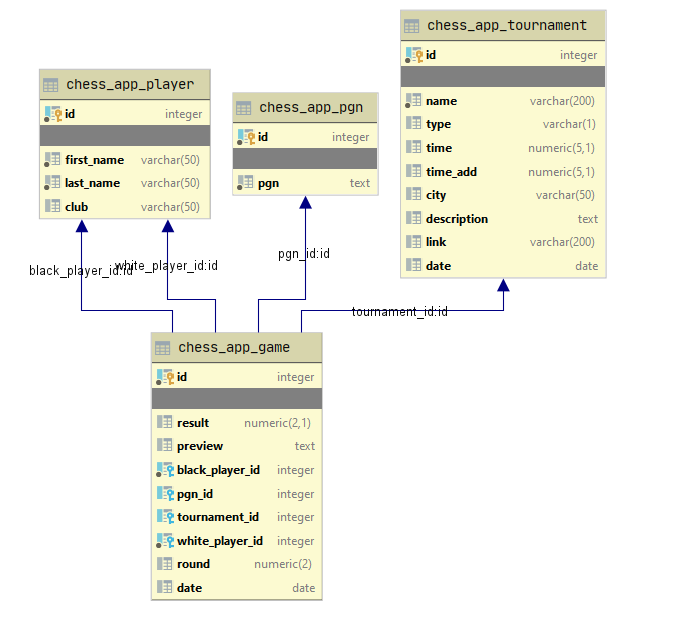

# Chess game manager

## Przewodnik po kodzie:

### Użyte technologie:

#### Backend

* Baza danych PostgreSQL
* Framework Django

#### Frontend

* Bootstrap 4
* Javascript
* Biblioteka `pgn4web` do generowania szachownic 

### Baza danych:



### Definicja modeli do bazy danych:

```python
from django.db import models

from chess_app.lookups import OnlyYearAndMonth


class Parse(models.Model):
    upload = models.FileField(upload_to="")

    def __str__(self):
        return '%s' % (self.upload)


class Tournament(models.Model):
    name = models.CharField(max_length=200)
    description = models.TextField(max_length=5000, null=True, blank=True)
    type = models.CharField(max_length=1, null=True)
    time = models.DecimalField(max_digits=5, decimal_places=1, default=0, null=True, blank=True)
    time_add = models.DecimalField(max_digits=5, decimal_places=1, default=0, null=True, blank=True)
    date = models.DateField(null=True, blank=True)
    city = models.CharField(max_length=50, null=True, blank=True)
    link = models.CharField(max_length=200, null=True, blank=True)

    models.DateField.register_lookup(OnlyYearAndMonth)

    def __str__(self):
        return self.name


class Player(models.Model):
    first_name = models.CharField(max_length=50)
    last_name = models.CharField(max_length=50)
    club = models.CharField(max_length=50, null=True, blank=True)

    def __str__(self):
        return self.first_name+' '+self.last_name


class PGN(models.Model):
    pgn = models.TextField(max_length=5000)


class Game(models.Model):
    white_player = models.ForeignKey(Player, related_name='white', on_delete=models.CASCADE)
    black_player = models.ForeignKey(Player, related_name='black', on_delete=models.CASCADE)
    date = models.DateField(null=True, blank=True)
    result = models.DecimalField(max_digits=2, decimal_places=1, null=True, blank=True)
    tournament = models.ForeignKey(Tournament, on_delete=models.CASCADE, null=True, blank=True)
    round = models.IntegerField(default=1, null=True, blank=True)
    pgn = models.ForeignKey(PGN, on_delete=models.CASCADE, null=True, blank=True)
    preview = models.TextField(max_length=100, null=True, blank=True)

    def __str__(self):
        return self.white_player.first_name + ' ' + self.white_player.last_name + ":" + self.black_player.first_name + ' ' + self.black_player.last_name + ' id:' + str(
            self.id)


```

### Moduł parsowania danych

```python
def get_data(file, request):
    pgn = open(file, encoding="utf-8-sig")
    pgns = []

    game = chess.pgn.read_game(pgn)
    t_name = game.headers.get("Event", "?")
    t_date = game.headers.get("EventDate", "????.??.??")
    t_city = game.headers.get("Site", "?")
    request.session['t_name'] = t_name
    request.session['t_date'] = t_date
    request.session['t_city'] = t_city
    while game is not None:
        pgns.append(str(game))
        game = chess.pgn.read_game(pgn)

    meta = {'pgn': pgns}

    pgn.close()
    if os.path.exists(file):
        os.remove(file)
    files = Parse.objects.all()
    for file in files:
        file.delete()
    return meta


def get_player_data(name, team):
    if len(name) == 0 or name[0] == "?":
        last_name = "Nieznany"
        first_name = "Zawodnik"
    else:
        last_name = name[0]
        if len(name) == 2:
            first_name = name[1]
        else:
            first_name = ""
    player, created = Player.objects.get_or_create(first_name=first_name, last_name=last_name)
    if team != "?" and team is not None:
        player.club = team
        player.save()
    return player


def get_tournament_data(t_cd):
    name = t_cd.get('name')
    description = t_cd.get('description')
    type = t_cd.get('type')
    time = t_cd.get('time')
    time_add = t_cd.get('time_add')
    date = t_cd.get('date')
    city = t_cd.get('city')
    link = t_cd.get('link')
    if name != "?" and name != "" and name is not None:
        tournament, created = Tournament.objects.get_or_create(name=name)
        tournament.date = date
        tournament.description = description
        tournament.type = type
        tournament.time = Decimal(time)
        tournament.time_add = Decimal(time_add)
        tournament.city = city
        tournament.link = link
        tournament.save()
        return tournament
    else:
        return None


def get_game_data(white_player, black_player, tournament, pgn, game, date):
    result_str = game.headers.get("Result", "*")
    if result_str == "1-0":
        result = 1.0
    elif result_str == "0-1":
        result = 0.0
    elif result_str == "*" or result_str == "?":
        result = None
    else:
        result = 0.5
    round_str = game.headers.get("Round", "?")
    if round_str == "?":
        round = None
    else:
        round = float(round_str)
    Game.objects.get_or_create(white_player=white_player, black_player=black_player,
                               date=date, result=result, tournament=tournament,
                               round=round, pgn=pgn, preview=str(game.mainline_moves())[0:100] + "...")


def parse_data(data, tournament):
    game = chess.pgn.read_game(io.StringIO(data))
    date_str = game.headers.get("Date", "?")
    try:
        date = parse(date_str).date()
        if date.year < 1950:
            date = None
            game.headers["Date"] = ""
    except ValueError:
        date = None
        eventDate =  game.headers.get("EventDate", "?")
        if eventDate != "?":
            date = eventDate
            game.headers["Date"] = eventDate
        elif tournament and tournament.date:
            date = tournament.date
            game.headers["Date"] = tournament.date
        else:
            game.headers["Date"] = ""
            date = None
    if tournament and not tournament.date and date:
        tournament.date = date
        tournament.save()
    data = game
    pgn, created = PGN.objects.get_or_create(pgn=data)
    name = game.headers.get("White", "?").split(',')
    team = game.headers.get("WhiteTeam", "?")
    white_player = get_player_data(name, team)
    name = game.headers.get("Black", "?").split(',')
    team = game.headers.get("BlackTeam", "?")
    black_player = get_player_data(name, team)
    get_game_data(white_player, black_player, tournament, pgn, game, date)
```


### Modyfikacja działania filtrowania - dokładność do miesięcy:

```python
class OnlyYearAndMonth(Lookup):
    lookup_name = 'ym'

    def as_sql(self, compiler, connection):
        lhs, lhs_params = self.process_lhs(compiler, connection)
        rhs, rhs_params = self.process_rhs(compiler, connection)
        params = [rhs_params[0].year, rhs_params[0].month]
        return 'extract(year FROM %s) = %s AND extract(month FROM %s) = %s' % (lhs, rhs, lhs, rhs), params
```

###  Wyszukiwanie i generowanie grup partii należących do turnieju:

```python
class TournamentDetails(DetailView):
    model = Tournament
    template_name = "../templates/tournament.html"

    def get_context_data(self, **kwargs):
        games = list(Game.objects.filter(tournament_id=self.object.id).order_by("-id"))

        games_grouped = dict()
        for game in games:
            r = game.round
            if r is None:
                r = 0
            if games_grouped.get(r):
                games_grouped[r].append(game)
            else:
                games_grouped[r] = [game]
                
        context = super(TournamentDetails, self).get_context_data(object_list=sorted(games_grouped.items()), **kwargs)
        return context
```

### Filtry

```python
class TournamentsListFilter(django_filters.FilterSet):
    class Meta:
        model = Tournament
        fields = {
            "name": ["icontains"],
            "date": ["ym"],
            "city": ["icontains"],
            "time": ["exact"],
            "type": ["exact"]
        }


class GamesListFilter(django_filters.FilterSet):
    name_filter = django_filters.CharFilter(method='name_filter_method')
    club_filter = django_filters.CharFilter(method='club_filter_method')

    class Meta:
        model = Game
        fields = {
            "date": ["ym"],
            "tournament__name": ["icontains"],
            "tournament__type": ["exact"],
            "name_filter": ["name_filter"],
            "club_filter": ["club_filter"]
        }


    def name_filter_method(self, queryset, name, value):
        return queryset.filter(
            Q(white_player__last_name__icontains=value) |
            Q(black_player__last_name__icontains=value)
        )

    def club_filter_method(self, queryset, name, value):
        return queryset.filter(
            Q(white_player__club__icontains=value) |
            Q(black_player__club__icontains=value)
        )
```

### Dodatkowy skrypt w JS

Ręczne usuwanie partii przed dodaniem do bazy

```javascript
document.querySelectorAll("a[single-game-deleter]").forEach(b => {
    b.addEventListener("click", function(event){
        const targetElement = event.target || event.srcElement;
        const div_id = targetElement.getAttribute('single-game-deleter')

        let found_div = document.querySelector('div[single-game-id="' + div_id + '"]')
        found_div.parentNode.removeChild(found_div);
    });
})
```

