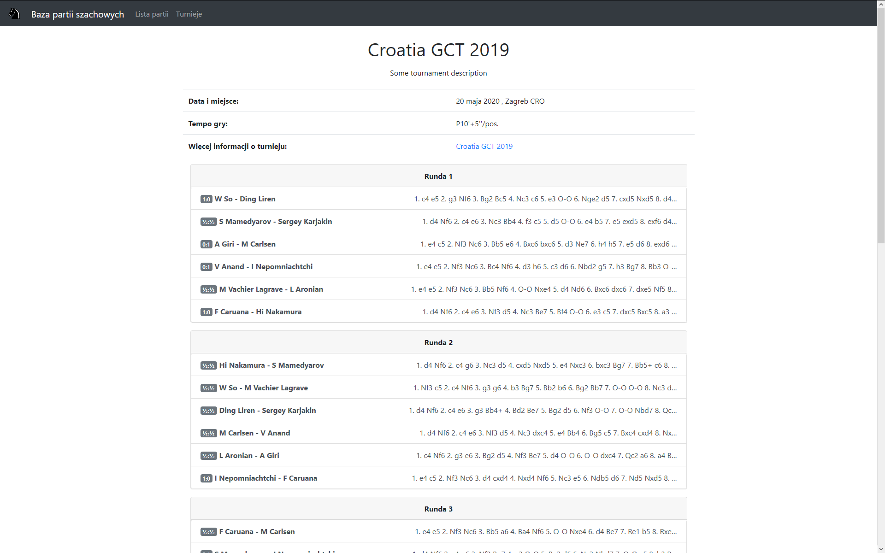

# Chess Games Manager

## About app
Web application to upload, manage and view chess games. Created using Django framework and PostgreSQL database. The app was made as a project for *Databases* classes. 

## Functionality
App allows the following things:
- Upload and parse multi-games `*.pgn ` file and add automatically tournament, games and players to database
- List and filter all games in database
- List and filter all tournaments in database
- Manage and change games, players and tournaments properties in admin panel
- Display tournament details and all imported games played during the tournament
- Generate pgn4web interactive board with game content.
- Export single game to `*.pgn` file to use in chess software

## Screenshots

### Games list:

## 

### Tournaments list:


### Tournament details view:



### Game view:


## Build instructions

- `pip install -r requirements.txt`
- create `.env` file in `chess_game_viewer` folder with the following content:

    ```bash
    export DB_HOST=<your db details here>
    export DB_PORT=<...>
    export DB_USER=<...>
    export DB_PASS=<...>
    export DB_NAME=<...>
    export SECRET_KEY=<your python secret key>
    ```
- `python manage.py runserver`

## Authors

- [kuczi55](https://github.com/kuczi55)
- [rivit98](https://github.com/rivit98)
- [Jck-eN](https://github.com/Jck-eN)